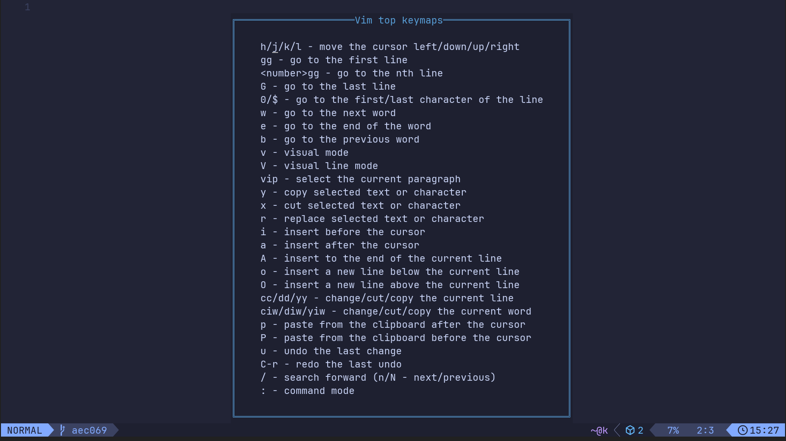

# vim-top-keymaps.nvim

This plugin shows the most frequently used Vim keymaps in my opinion.



## Installation

Install the plugin with your package manager.

### lazy.nvim

```lua
{
  "sk1t0n/vim-top-keymaps.nvim",
  config = function()
    require("vim-top-keymaps").setup()
  end,
}
```

## Keymaps

- `<leader>H` - run command `VimTopKeymapsToggle`
